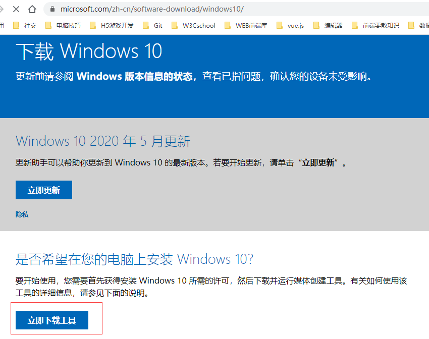
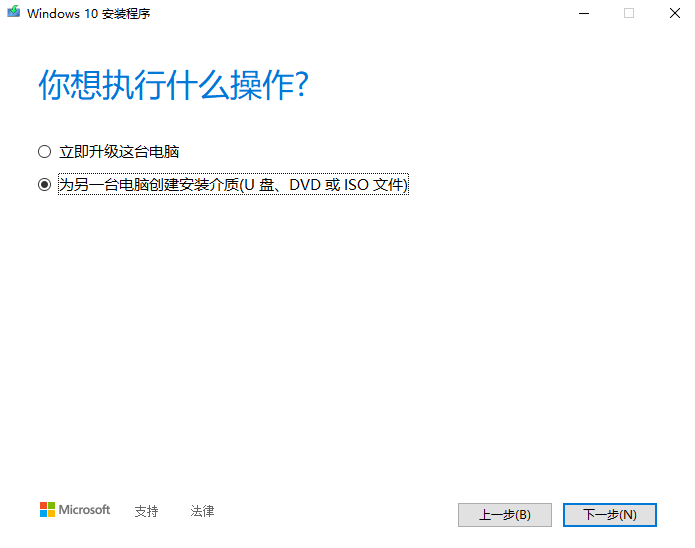

# win10 下载与安装

## win10 启动盘的制作

1. 微软官网有一个[MediaCreationTool 工具](https://www.microsoft.com/zh-cn/software-download/windows10/)，用以升级 win10。
2. 首先下载这个工具到本地，并打开这个这个 exe，接受它的声明和许可条款，下一步。  
   
3. 它可以直接将本机操作系统升级为 win10，也可以为其他电脑创建 win10 的介质（U 盘、光盘、ISO 文件）；我们选择后者，但不会使用光盘，而是使用的是 U 盘，继续下一步。  
   
4. 语言、体系结构和版本会按照本机自动选择好，当然你也可以选择其他版本，继续下一步。随后会出现让选择 U 盘或者 ISO 文件。  
   
5. 选择 ISO 会多出一步“刻录”，也是可以刻录到 U 盘的，使用[UltraISO](https://cn.ultraiso.net/)，有教程也很简单就不展开了。
6. U 盘准备 8G 或 16G，我的是以 NTFS 格式进行格式化的，有些 UEFI 的启动盘要求是 FAT32 格式；下载或刻录完毕，该 U 盘就是启动盘了。

## win10 安装

1. 安装新系统，C 盘里里重要的东西要自己备份到其他盘，因为不会影响到其他盘的资料。
2. 再将自己的 UEFI 或 BIOS 设置成 U 盘启动，我的是 Dell 系列的电脑，可以参照这篇[Dell 新版 BIOS 设置 U 盘启动](https://jingyan.baidu.com/article/3d69c55126805bf0cf02d7ed.html)进行设置。
3. 插上你的 win10 启动盘，重启电脑，选择你 U 盘的名字再确定，就会开始安装 win10 系统。
4. 安装过程非常简单，按照你需求进行一下选择，安装好会进入新系统。

## win10 激活

1. win10 系统最好激活一下，虽然表面上说不会影响速度什么的，使用上总感觉会慢；可以自行到官网购买 win10 激活码，也可以去 tb 等网站上购买私人渠道的。
2. 我这里介绍一个网站：[Windows 激活工具](https://windows.kangkangd.cn/)，会下载一个软件，一键激活 windows 和 office，非常强大和方便。
3. 其他网站下载的激活软件总会绑一些乱七八糟的东西给你，很烦也很不安全；这个软件非常不错，很干净，暂时免费也没有失效！记得激活后重启！
